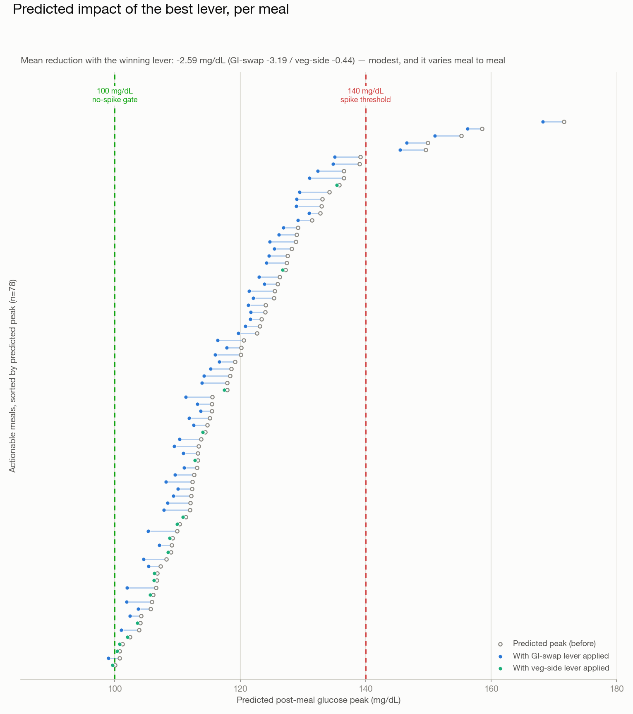
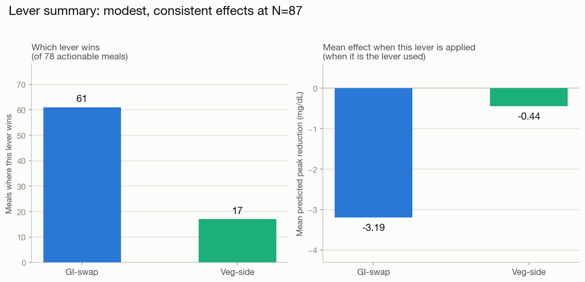

# From Glucose Data to a Recommendation: A Personal CGM Case Study

I wore a continuous glucose monitor (Lingo) for two 14-day windows and logged every
meal I ate. CGM apps are good at *showing* you a spike after it happens — a line
climbing on a chart, an alert after the fact. They are not good at telling you,
before you eat, which specific change to a specific meal would have kept that line
flatter. I built a small end-to-end pipeline to close that gap: turn my Apple
Health export into a clean meal dataset, train a model that predicts how a given
meal will move my glucose, and wrap it in a recommendation engine that simulates
realistic changes to a meal and tells me which one helps most.

This isn't a research paper. It's a working system on N=1 data. For every choice
below: what got decided, what the alternative was, and what it actually moved.

## Target user & value prop

The target user is a health-conscious CGM wearer — the fast-growing segment using
devices like Lingo, Stelo, or Libre outside of a diabetes diagnosis, purely for
metabolic health. Most apps in this category score or summarize a meal after it's
eaten. Several go further: January AI predicts a food's glucose impact before you
eat and suggests swaps, Levels compares two logged meals, Signos learns which
foods spike a given user. So forward-looking, swap-style guidance isn't what sets
this project apart — the established products already ship versions of it, generally
from cohort models whose personalization method isn't published. The gap this
project targets is narrower and about method: fit the model on one person's own
glucose-response data, make the recommendation legible — a predicted mg/dL delta
for a specific change to the specific meal in front of you — and stay silent when
the model isn't confident. That's a deliberate trade of cohort-scale accuracy for
transparency and own-data personalization, not a capability the category lacks.

## Competitive landscape

| Product | What it offers | How this project differs |
|---|---|---|
| Levels | Compares two already-logged meals side by side; generic swap tips (protein/fat/fiber first) | Retrospective comparison, not a simulated counterfactual on an upcoming meal; tips aren't fit to a personal model |
| January AI | Predicts a food's glucose impact pre-meal, personalizes after ~5 days of CGM + food logging; suggests food swaps | Personalization method is unpublished — possibly cohort-calibrated rather than fit on one person's data |
| Signos | Learns which foods spike a given user; recommends what to eat next | Ranks food choices going forward, not a modeled delta for changing the specific meal in front of the user |
| Veri | Scores logged meals from glucose response + a population "Food Quality" label | Its own copy calls the dietary guidance "generalized"; no per-meal simulated swap with a predicted number |
| Abbott Lingo | Weekly reports built on five general behavioral principles | Retrospective and reactive by design; no pre-meal, per-meal simulation |

*Capabilities surveyed July 2026; these products ship updates frequently and may
have changed since.*

## What I built

Three stages, one meal at a time.

**Data.** Apple Health's `export.xml` holds everything I needed — Lingo's glucose
readings, my food log (Bevel), and Apple Watch step/activity data. I parsed it into
a long record table, filtered to the two study windows, de-duplicated a
data-integrity bug I found in the food log (more below), and aggregated food
entries within a 15-minute window into single meals — 87 in total. For each meal I
computed `baseline_glucose`, `peak_rise`, and `iauc` (incremental area under the
curve) over a 2-hour post-meal window, and enriched each meal with a manually
curated glycemic index (GI) for its carb source.

**Model.** A linear regression predicting `peak_rise` and `iauc` from six
features: GI, carbohydrates, fat, fiber, protein, and pre-meal steps. Linear, not
tree-based — deliberately, so the recommendation engine downstream can perturb an
input and read a smooth, interpretable response instead of a step function (see
the decisions table).

**Recommendation engine.** For each meal, if the model predicts a peak above
Lingo's own published no-spike threshold (100 mg/dL), the engine simulates two
realistic, proportional changes to that meal and returns whichever lowers the
predicted peak most.

Here's the engine's output for the meal in the figure above:

> **Meal #23 — dinner with rice as the main carb.** 669 kcal, 80 g carbs, GI 73.
> Predicted peak: **149.6 mg/dL** (measured: 159 mg/dL). The engine tested both
> levers — swap to a lower-GI carb source (−4.1 mg/dL) or add a low-carb
> vegetable side (−0.4 mg/dL) — and recommended the **GI swap**.

## Key decisions

`DECISIONS.md` is the append-only source of truth for every choice below,
including the rejected alternatives. This table is the distillation.

| Decision | Alternatives considered | Why |
|---|---|---|
| **Split GI and carbs into separate features**, instead of one `glycemic_load` scalar | A combined `glycemic_load = GI × carbs / 100` scalar, built first per the original plan | Tested both; separate features won on cross-window R² for both targets, both directions. A combined scalar can't distinguish "swap the food" from "eat less of it" — collapsing them would have made the two levers below indistinguishable to the model. |
| **Dropped post-meal activity** as both a model feature and a lever | Keeping `post_steps`, `post_active_energy`, `walked_after_eating` in the feature set | The coefficient on post-meal walking came out positive — more walking predicting a *higher* peak. Root cause: I only walk after meals I already expect to spike; low-carb meals don't get a walk because I don't expect one to be needed. Correlational data can't separate "walking helped" from "I selected which meals to walk after," and the second effect dominates. Removing the features improved cross-window generalization everywhere they had undiluted influence. |
| **Proportional (multiplicative) perturbations**, not flat deltas | Fixed-magnitude changes (e.g. always −25 GI points, always +5g fiber) | Flat deltas produced nearly identical simulated effects across very different meals — an artifact of the perturbation size, not a real signal. Scaling each lever relative to the meal's own composition fixed it. |
| **Two levers shipped; three rejected** | "Eat fiber first" (sequencing); 25% portion reduction; flat-magnitude versions of the surviving levers | Eating order isn't representable in meal-level (not item-level) data. Portion reduction fails twice over: it's not realistic user-facing advice (requires stopping mid-meal), and uniform scaling falsely assumes nutritional homogeneity across items in a meal — you can't "skip the rice, keep the chicken" in a one-row-per-meal dataset. |
| **Linear regression over tree-based models** | Random forest / gradient boosting | Trees would likely fit the training data better, but their perturbation response is a step function, not smooth — directly working against a recommendation engine whose job is ranking small, realistic meal changes. Not even tried for v1; the perturbability requirement made the call before the modeling did. |
| **Found and fixed a duplicate-logging bug** in the food-tracking data | Exact-match deduplication | Bevel was double-logging entries across every macro field independently, with small differences between true duplicates (re-parsing/rounding) that broke exact-match dedup. Built near-duplicate detection (same record type, <10 min apart, <10% value difference) plus manual confirmation. Not cosmetic: the macros-only baseline R² moved from −0.34 (corrupted) to −0.07 (real) — a materially different starting point for every decision downstream. |
| **Caught an mmol/L vs. mg/dL unit bug** in the spike gate | — | `meal_dataset` stores glucose in mmol/L; the spike/no-spike gate compares against Lingo's published mg/dL threshold. An unconverted comparison would have silently gated meals on the wrong scale. Fixed with an explicit ×18.0182 conversion before thresholding. |

## Results

Across 87 meals, the engine gated 9 as "no significant spike predicted" and made
a recommendation on the remaining 78 (89.7%). Of those, it recommended a GI swap
61 times and a vegetable side 17 times — a split that mostly reflects the
availability gate (a GI swap is only offered when a meal's GI is already above
30, so low-GI meals default to the vegetable-side lever or no action).

The predicted peaks it's reacting to: mean 117.6 mg/dL, median 114.8 mg/dL, with
the highest-risk meal in the dataset predicted at 171.6 mg/dL.

The headline number: the mean predicted reduction from the winning lever is
**−2.59 mg/dL** (GI swap −3.19, vegetable side −0.44). That's modest — this is
not a system that flattens spikes. The mean also understates what matters most:
reduction isn't evenly distributed — high-GI meals see larger swings,
already-modest meals see almost nothing (correctly, since there's less to fix
there). I'd rather report the unglamorous mean and explain the spread than lead
with a cherry-picked best case.

The cross-window validation tells a related story about where the model is and
isn't trustworthy. Training on window 1 and testing on window 2 gives R² of
−0.015 (peak_rise) and 0.023 (iauc) — barely better than predicting the mean.
Training on window 2 and testing on window 1 gives 0.178 and 0.224 — real, if
modest, signal. That asymmetry is itself a finding, not symmetric noise — it
held across every feature-set variant tested. The leading hypothesis (in
`DECISIONS.md`) is that window 2 has a wider, noisier behavioral range that
happens to generalize forward better than window 1's narrower range generalizes
backward.

## Limitations

- **Lever magnitudes are assumption-calibrated, not food-realistic.** A GI swap
  is modeled as GI ×0.6 and a vegetable side as +3g fiber / +4g carbs — fixed
  percentages, not the actual delta of swapping white rice for basmati.
- **No item-level or sequencing detail.** `meal_dataset` is one row per meal; the
  model can't represent "eat the vegetables first" or "skip the rice, keep the
  chicken," only whole-meal changes.
- **Walking is excluded as a lever**, not because it doesn't matter, but because
  the self-selection confound above makes its true effect unrecoverable from
  this data.
- **Advice ceiling.** A 6-feature linear model on 87 meals produces
  population-sound recommendations with personalized magnitudes — not yet
  personalized *content*. Whether I'm unusually fiber-sensitive relative to
  population norms is a real question this version can't answer.

## Beyond N=1: what a v2 looks like

The core idea — predict, then simulate levers, then recommend the best one —
doesn't need to stay N=1. Three things would need to change.

**Cold start via population priors, then personalize.** A new user has no meal
history to train on. Ship with coefficients fit on a cohort CGM dataset as a
population prior (deliberately *not* used here, precisely because mixing it into
this personal model would have undercut the N=1 framing), then blend toward a
personalized fit as each user logs meals — the same cold-start pattern
recommendation systems use elsewhere.

**Turn the walking confound into a designed experiment.** This is the most
interesting unresolved thread in the project. In this data, walking after meals
is confounded with the decision to walk — I only walk after meals I expect to
spike, so the correlational effect runs backwards. A cohort product can fix this
the way a field experimenter would: randomize walk/no-walk assignment across
meal types for a subset of users ("for the next two weeks, we'll randomly tell
you whether to take a short walk after eating"), recover the real causal effect
from the randomized subset, and ship walking as a third lever once de-confounded.

**Success metrics that aren't R².** Time-in-range (the standard clinical CGM
metric) as the north star, plus recommendation adherence (did the user take the
suggested action) and a simple trust/satisfaction signal — a recommendation
nobody follows doesn't improve anyone's glucose, no matter how well it's modeled.

What ships first in v2: the population-prior cold start, paired with the GI-swap
lever alone. It's the lever with the larger, more consistent effect (61 wins,
−3.19 mg/dL mean) and the simplest to explain to a user — "this food, but a
lower-GI version." The vegetable-side lever and the walking experiment come
after, once there's a cohort large enough to run the randomization.
