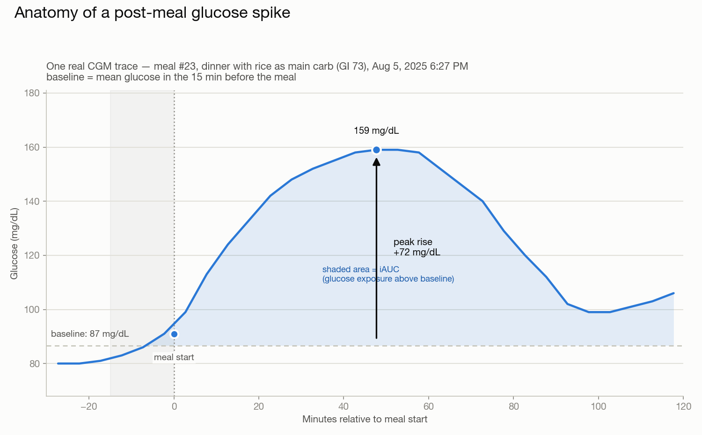

# CGM Insights

**A personal CGM advisor: it predicts how a meal will spike my glucose, then tells
me the one change that would flatten it — before I eat, not after.**



Built on my own data: two 14-day windows of Lingo CGM readings + a hand-logged
food journal, 87 meals total.

- **89.7% of meals actionable** — the engine gated 9/87 as "no spike predicted"
  and recommended a specific change on the other 78 (GI-swap won 61, veg-side 17)
- **Small but real effect sizes** — mean predicted peak reduction −2.59 mg/dL
  from the winning lever (GI-swap −3.19), larger on high-GI meals
- **Decision quality over model complexity** — every choice, including the
  rejected alternatives, is logged in [DECISIONS.md](DECISIONS.md)

📄 **[Read the full case study →](CASE_STUDY.md)** — problem, key decisions,
results, limitations, and what a beyond-N=1 v2 looks like.

---

The append-only [DECISIONS.md](DECISIONS.md) is the authoritative record of *why*
each modeling choice was made (including rejected alternatives). This README
describes *what* the pipeline currently does; where the two disagree, DECISIONS.md wins.

## Data

1. **Glucose** — two 14-day windows of raw CGM data (Lingo).
2. **Diet** — manual food journal (Bevel); the carb source per meal
   (rice / bread / potato / …) was hand-identified from Bevel photos, and its
   glycemic index (GI) then assigned by an LLM against published table values.
3. **Movement** — step counts, active energy, and heart rate (Apple Watch).
4. All of the above are exported together from Apple Health (`data/export.xml`).

Two 14-day windows (`window` 1 and 2) are used as independent train/test splits —
see [DECISIONS.md](DECISIONS.md) for exact dates.

## Pipeline — [src/parse_health.ipynb](src/parse_health.ipynb)

Apple Health `export.xml` → cleaned `data/meal_dataset.parquet` (one row per meal).

1. Parse the Health XML into a long record table.
2. Filter to the two windows and to the relevant sources (Lingo, Bevel, Apple Watch).
3. **Dedup the Bevel double-logging bug** — near-duplicate detection (same record
   type, <10 min apart, <10% value difference) across *all* macro fields, manually
   confirmed. See DECISIONS.md; this materially changed the baseline R².
4. Aggregate food entries within 15 minutes into a single meal (~87 meals total).
5. **Glucose features** over a 2 h response window per meal: `baseline_glucose`
   (mean of the 15 min pre-meal), `peak_rise` (max rise above baseline), and
   `iauc` (incremental area under the curve, trapezoid on the baseline-clipped rise).
6. **Activity features**: pre/post-meal steps, active energy, and heart rate.
7. **GI enrichment**: merge the hand-identified carb source per meal with its
   LLM-assigned GI value.

## Model — [src/model.ipynb](src/model.ipynb)

- **Linear regression**, chosen deliberately over tree models so the recommendation
  engine can perturb inputs and read smooth, interpretable coefficient responses.
- **Targets**: `peak_rise` and `iauc`.
- **Final feature set**: `GI`, `DietaryCarbohydrates`, `DietaryFatTotal`,
  `DietaryFiber`, `DietaryProtein`, `pre_steps`.
  - GI and carbs are kept as **separate** features (not combined into a single
    `glycemic_load` scalar) so the two levers below stay independently controllable.
  - Post-meal activity features were **dropped** — a self-selection confound (walking
    after meals expected to spike) gave them a backwards sign. Details in DECISIONS.md.
- **Validation**: cross-window (train window 1 → test window 2, and vice versa),
  not just k-fold CV — the honest generalization test for N=1 data.

## Recommendation engine

For each meal, if the model predicts a spike (gated at a predicted peak of
≥100 mg/dL, using Lingo's own published no-spike threshold), it simulates
**two proportional levers** and returns whichever lowers the predicted peak most:

1. **Swap to a lower-GI carb source** — `GI ×= 0.6`, only offered when `GI > 30`
   (no point "swapping" a food that's already low-GI).
2. **Add a side of low-carb vegetables** — `DietaryFiber += 3`, `DietaryCarbohydrates
   += 4` (paired, since no real food adds fiber with zero carbs).

Perturbations are proportional/relative to each meal's actual composition rather
than flat deltas. Levers considered and rejected (eat-fiber-first ordering, portion
reduction, flat-magnitude perturbations) are documented in DECISIONS.md.

## LLM labeling — [src/carb_source_labeler.py](src/carb_source_labeler.py)

The one step of the pipeline that is pure manual labor — and therefore can't
scale past N=1 — is identifying each meal's carb source from its Bevel photo.
`carb_source_labeler.py` automates it with a vision model: photo → one label
from the dataset's 44-food vocabulary (+ `other`), with a self-reported
confidence flag. GI is **not** re-estimated; the predicted label maps to GI
through the same food→GI table the pipeline already uses, so label errors
propagate to recommendations exactly as they would in production.

The 87 hand labels double as the ground-truth eval set. Metrics, in order of
importance:

1. **Recommendation flip rate** — meals where the engine's output changes
   under the predicted label. A misclassification only matters if it changes
   what the user is told.
2. **Classification accuracy** — raw label quality, for diagnosis.
3. **Error rate by confidence flag** — the basis for a routing rule
   (auto-accept high-confidence labels, send low-confidence ones to review).

Because a meal aggregates food entries logged within 15 minutes, one meal can
have several photos of different foods — the classifier receives all of a
meal's photos in one call and labels the meal as a whole.

Status: awaiting the photo export. The photos live in iPhone Photos (Apple
Health's export carries macros and an opaque `BevelFoodLogId` — no food names
or images). Workflow: export originals for the two study windows into
`data/photos_raw/`, then run [src/match_photos.py](src/match_photos.py) to
timestamp-match them into `data/photos/<meal_id>_<k>.jpg`.

## Limitations (v1)

- Small training data (~87 meals, single person).
- Food nutrition and GI values are approximate (manual journaling; GI assigned
  by an LLM against published table values, not independently verified).
- Magnitude calibration uses fixed percentage assumptions, not per-food-realistic swaps.
- Meal-level granularity only — no within-meal item ordering or portion modeling.
- Walking/activity excluded as a lever due to the unresolved self-selection confound.

See [DECISIONS.md](DECISIONS.md) for the full limitations discussion and the paths
explored but not pursued (transfer learning, binary spike classifier, time-of-day
features, tree models).

## Setup

```bash
python3 -m venv venv
source venv/bin/activate
pip install -r requirements.txt
pip install jupyterlab
jupyter lab
```

Run [src/parse_health.ipynb](src/parse_health.ipynb) first (builds
`data/meal_dataset.parquet`), then [src/model.ipynb](src/model.ipynb).
